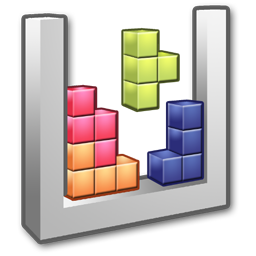

    
  

  <h1 align="center">Tetris AI </h1>
  <!-- TABLE OF CONTENTS -->
  <h2 id="table-of-contents">Table of Contents</h2>
  

    
Table of Contents

    <ol>
      <li><a href="#about-the-project"> ➤ About The Project</a></li>
      <li><a href="#howtoinstall"> ➤ How to Install</a></li>
      <li>
        <a href="#project-files-description"> ➤ Project Files Description</a>
      </li>
      <li><a href="#Credits"> ➤ Credits</a></li>
    </ol>
  

  
  
  
  <!-- ABOUT THE PROJECT -->
  <h2 id="about-the-project"> About The Project</h2>
  
  

   Using Python, pygame, numpy, random libraries, we can create our own neural network AI with Genetic Algorithm.
  

  <ul>
    <li>
        Genetic analysis uses three main types of rules each procedure to generate the next generation from existing data:
        <ul>
            <li>Selection rules tend to individuals called parents who distribute to the country in the next generation. Selection is usually stochastic and may depend on the scores of individuals.</li>
            <li>  Transition rules create dimensions for the next generation to bring the two parents together.</li>
            <li>Mutation rules apply random changes to parents to create children.</li>
        </ul>
    </li>
  </ul>

  
    <h2 id="howtoinstall">⛓️ How to install</h2>
  
  

    There are one way to deal with it:
  <ul>
    <li>Open the folder where the project files. with any IDE you use. </li>
    <li>Run Main(main.py) file with IDE</li>
   </ul>
  

  
  
  <!-- PROJECT FILES DESCRIPTION -->
  <h2 id="project-files-description">📝 Project Files Description</h2>
<ul>
    <li><b>TetrisAI.py</b> - Where all the main classes.</li>
    <li><b>datas.csv</b> - Where all the data that we generated from the application.</li>
  </ul>

  <!-- CREDITS -->
  <h2 id="Credits"> Credits</h2>
<ul>
    <li><b>Deniz ÖZCAN</b> - 200202106</li>
    <li><b> Nimet ATİLA</b> - 200202127</li>
    <li><b>Ali Can DOĞRU</b> - 200202067</li>
  </ul>
